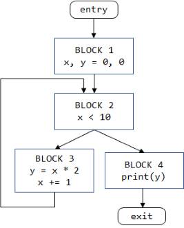

# python-program-analysis

A Typescript library for parsing Python 3 and doing basic program analysis, 
like forming control-flow graphs and def-use chains.

## Parsing

To parse Python 3 code, pass a string containing the code to the `parse` method.

```
const code = [
    'x, y = 0, 0',
    'while x < 10:',
    '   y += x * 2',
    '   x += 1',
    'print(y)'
];
const tree = parse(code.join('\n')); 
```
This method returns a tree of `SyntaxNode` objects, discriminated with a `type` field. 
The library also provides a function `walk` for pre-order tree traversal. With no arguments, it returns 
a list of the syntax nodes in the tree.  

```
walk(tree).map(node => node.type)
// produces ["module", "assign", "literal", "literal", "name", "name", "while", "binop", …]
```

Optionally, `walk` takes a visitor object with methods `onEnterNode` (for pre-order traversal) and `onExitNode` (for post-order traversal).

Syntax nodes can be turned back into code with the `printNode` function, which produces a string. There is no guarantee of round-tripping. That is `printNode(parse(`_code_`))` could be syntactically different than _code_, but will be semantically the same. For example, there may be extra parentheses around expressions, when compared with the original code. The `printNode` function is primarily for debugging.

## Control flow

A control flow graph organizes a parse tree into a graph where the nodes are "basic blocks" (sequences of statements that run together) and the edges reflect  the order of block execution.

```
const cfg = new ControlFlowGraph(tree);
```

`cfg.blocks` is an array of the blocks in the control flow graph, with `cfg.entry` pointing to the entry block and `cfg.exit` pointing to the exit block.
The control flow graph for the parse tree above looks like this.




 Each block has a list of its statements.
```
printNode(cfg.blocks[0].statements[0])
```
prints `x, y = 0, 0`.

The methods `cfg.getSuccessors` and `cfg.getPredecessors` allow the edges to be followed forward or backward.
```
const cond = cfg.getSuccessors(cfg.entry)[0];
printNode(cond)
```
prints `x < 10`.

## Data flow

The library also provides basic def-use program analysis, namely, tracking where the values assigned to variables are read. For example, the 0 assigned to `x` in the entry block is read in the conditional `x < 10`, in the assignments `y = x * 2` and `x += 1`. 

```
const analyzer = new DataflowAnalyzer();
const flows = analyzer.analyze(cfg).flows;
for (let flow of flows.items) 
    console.log(printNode(flow.fromNode) + 
        " -----> " + printNode(flow.toNode))
```
prints
```
x, y = 0, 0 -----> x < 10
x, y = 0, 0 -----> print(y)
x, y = 0, 0 -----> y = x * 2
x += 1 -----> x < 10
y = x * 2 -----> print(y)
x += 1 -----> y = x * 2
```

## Program Slicing

Program slicing removes lines from a program that are unnecessary to see the effect of a chosen line of code. 
For example, if we only care about the `print` statement in this program:
```
sum = 0
diff_sum = 0
for i in range(min(len(A), len(B))):
    sum += A[i] + B[i]
    diff_sum += A[i] - B[i]
print(sum)
```
then we can simplify the code to this:
```
sum = 0
for i in range(min(len(A), len(B))):
    sum += A[i] + B[i]
print(sum)
```

The function call `slice(`_P_`,`_loc_`)` takes a program _P_ (a parse tree) and a program location _loc_ and returns the program locations that are necessary for _loc_. 
For example, to do the slicing example above, we call 
`slice(ast, {first_line: 6, first_column: 0, last_line, 6: last_column: 10})` which returns a `LocationSet` whose members have `first_line` values of 1, 3, 4, and 6 (but not 2 or 5).

## API Specs

When deciding whether an API call needs to appear in a program slice, the slicing algorithm needs
to know whether the call has a side-effect on the variables that are passed to it (including the `self` parameter for method calls). The call `f(x)` has a side-effect on `x` if `f` updates a field (`x.m = y`), updates an element (`x[i] = y`), updates a global variable, or transitively calls another function that has a side effect. Rather than analyzing the code of a called function (which may not even be available), we rely on having specifications, recorded in JSON files. Here is the specification `pandas.json` (with some lines omitted):
```
{
  "pandas": {
    "functions": [
      "array",
      "bdate_range",
      ...
      { "name": "read_clipboard", "returns": "DataFrame" },
      { "name": "read_csv", "returns": "DataFrame" },
      { "name": "read_excel", "returns": "DataFrame" },
      ...
    ],
    "types": {
      "DataFrame": {
        "methods": [
          "abs",
          "add",
          "add_prefix",
          ...
          { "name": "pop", "updates": [0] },
          ...
        ]
      }
    }
  }
}
```
A module's spec provides a list of the module's functions, types, and submodules. A type spec provides a list of the type's methods. In the function/method list, if a function/method appears just as a name (for example, `"array"` or `"abs"`), then it has no side-effects and doesn't return any objects with specifications. Otherwise, the function/method appears as a dictionary with its name in a `name` field and any of the following:
* `updates` is an array of strings that lists the parameters that experience side-effects. 0 refers the `self` parameter, a number _k_ >= 1 refers to the _k_ th parameter, and any non-numeric string is the name of an updated global variable.
* `reads` is an array of strings with the global variables that the method reads. (If a slice includes a call to a function that reads a global, then it must also include any calls that update that global.)
* `returns` is the type of object the call returns, which is only necessary if that type has a spec. 

The specs allow `slice` to analyze code like the following:
```
import pandas as pd
d = pd.read_csv("some_path")
d.pop("Column")
d.memory_usage()
d.count()            // ← slice on this line
```
Looking at the spec above, we can see that `read_csv` return a `DataFrame` object, so `d` is a `DataFrame`. The call to `pop` on `d` has a side-effect on the `self` parameter (`d`), because `DataFrame`'s `pop` spec has an `updates` of [0]. Therefore, this call to `pop` must appear in the slice. On the other hand, the call to `memory_usage` has no side-effects, so it can be left out. So, the final slice includes lines 1, 2, 3, and 5, but not 4.

If there is no spec for an API call, then the data-flow and slicing algorithms conservatively assume that any passed parameter could experience a side-effect. 

# Contributing

This project welcomes contributions and suggestions.  Most contributions require you to agree to a
Contributor License Agreement (CLA) declaring that you have the right to, and actually do, grant us
the rights to use your contribution. For details, visit https://cla.opensource.microsoft.com.

When you submit a pull request, a CLA bot will automatically determine whether you need to provide
a CLA and decorate the PR appropriately (e.g., status check, comment). Simply follow the instructions
provided by the bot. You will only need to do this once across all repos using our CLA.

This project has adopted the [Microsoft Open Source Code of Conduct](https://opensource.microsoft.com/codeofconduct/).
For more information see the [Code of Conduct FAQ](https://opensource.microsoft.com/codeofconduct/faq/) or
contact [opencode@microsoft.com](mailto:opencode@microsoft.com) with any additional questions or comments.
